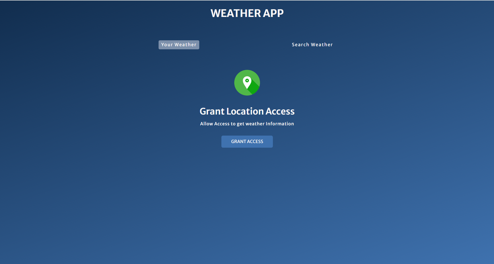
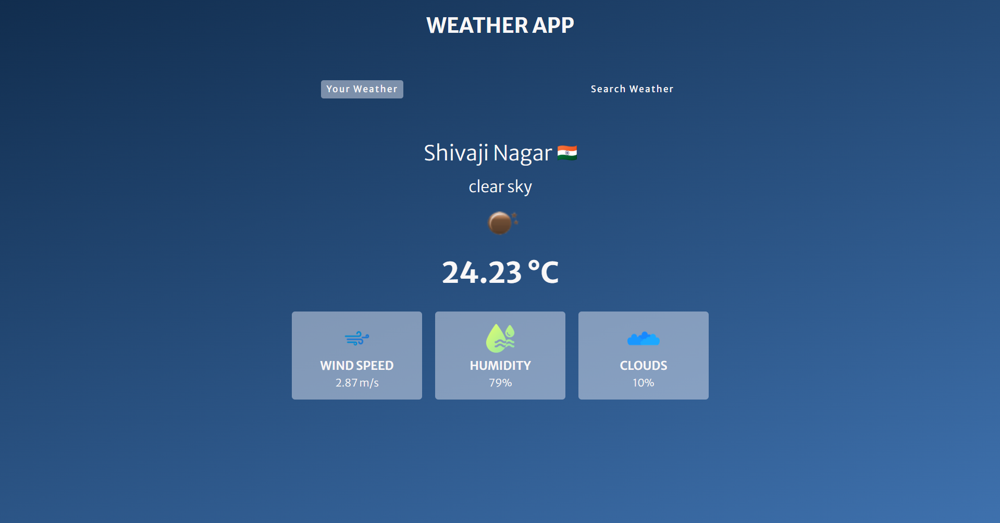
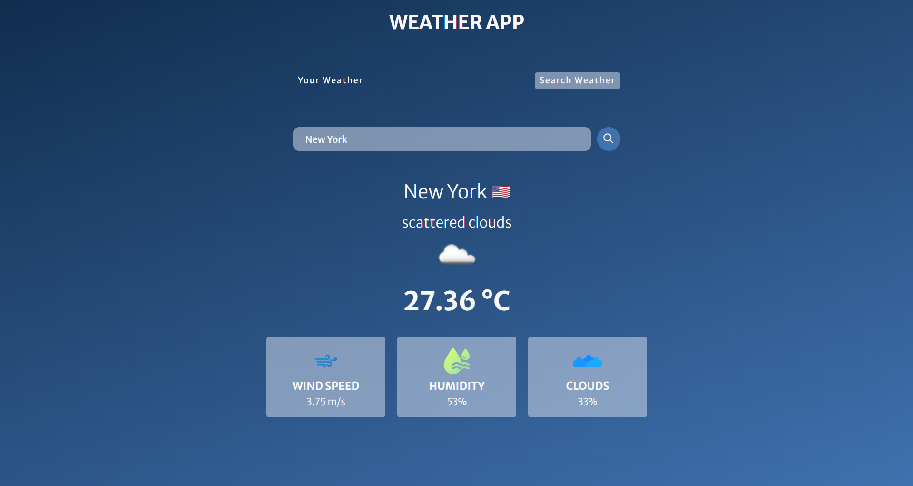

# 🌤️ Weather App

**Live Demo ➜** [Click here to try!](https://shindenikhil8.github.io/Weather_App/)

A beautiful, functional, and responsive **Weather App** built using **HTML**, **CSS**, and **JavaScript** that fetches live weather data using the **OpenWeatherMap API**. Get weather by your current location or search for any city worldwide.

---

## 🧩 Features

📍 **Your Weather**  
- Get live weather data using geolocation  
- Auto-detects your location (with permission)

🔍 **Search Weather**  
- Search by city name  
- Displays city flag, description, temperature, humidity, wind speed, and cloudiness

💬 **Live Feedback**  
- Loading animation while fetching data  
- Toggle tabs for location or search-based weather

🎨 **Modern UI**  
- Smooth layout with gradient background  
- Responsive design and elegant font styling

---

## 🖼️ Preview

<table>
  <tr>
    <td align="center">
      
      <br><em>Grant Location</em>
    </td>
    <td align="center">
      
      <br><em>Weather Display</em>
    </td>
    <td align="center">
      
      <br><em>City Search</em>
    </td>
  </tr>
</table>

---

## 🛠️ Tech Stack

| Tech        | Role                                  |
|-------------|---------------------------------------|
| `HTML`      | Structure and layout                  |
| `CSS`       | Styling, responsiveness, gradients    |
| `JavaScript`| Weather API integration and UI logic  |
| `OpenWeatherMap API` | Provides live weather data   |

---

## 📁 Project Structure

```
📦 weather-app/
├──Screenshots
   ├──Screenshots/City_Search.png
   ├──Screenshots/Grant_Location.png
   └──Screenshots/Weather_Display.png
├── index.html         # Main HTML structure
├── weather.css        # All UI styling and layout
├── weather.js         # JavaScript logic and API integration
└── #add all the images

```

---

## ⚙️ How It Works

- On **load**, checks for stored geolocation. If not present, asks for permission.
- Uses `navigator.geolocation` API to get coordinates and fetch weather from OpenWeatherMap.
- Alternatively, lets the user **search any city** using a form.
- Displays weather info like: 🌡️ temperature, 🌬️ wind, 💧 humidity, ☁️ clouds.

---

## 📌 API Key Note

> Replace the `API_KEY` in `weather.js` with your own key from [https://openweathermap.org/api](https://openweathermap.org/api)

```js
const API_KEY = "your_api_key_here";
```

---

## 🚀 Future Enhancements

- 🌙 Add dark/light theme toggle  
- 📅 Forecast for next 5 days  
- ❌ Show custom error if city not found  

---

Feel free to ⭐ star this repo and suggest improvements!

